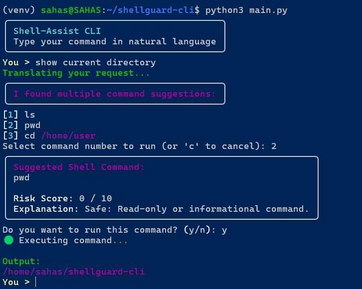
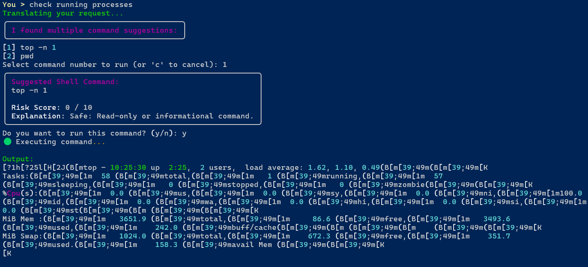
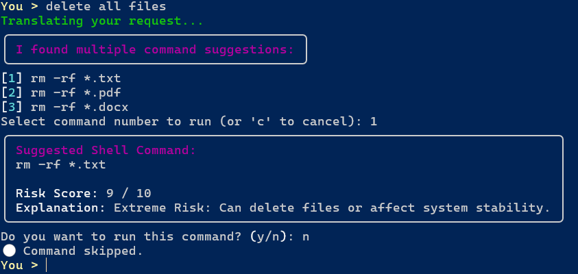

# 🛡️ Shell-Assist

**Shell-Assist** is a smart Linux shell assistant that translates natural language commands into secure shell commands with an added layer of risk analysis. Powered by a local LLM using Ollama, Shell-Assist helps users interact with their terminal safely and efficiently.

---

## 🚀 Features

- 🧠 **Natural Language to Shell Command Translation**
- 🔍 **Command Risk Scoring (0–10)**
- 🎨 **Color-Coded Risk Levels**
- 🛑 **Execution Confirmation Prompt**
- ⚙️ **Locally Hosted & Privacy-Focused (uses Ollama + Phi model)**

---

## 🔐 Risk Levels

| Score | Level         | Description                                      |
|-------|---------------|--------------------------------------------------|
| 0–2   | ✅ Safe        | Read-only or system information commands         |
| 3–4   | ⚠️ Low Risk    | File or directory operations in user space       |
| 5–6   | 🟠 Medium Risk | System or network queries                        |
| 7–8   | 🔴 High Risk   | System modifications or package installations    |
| 9–10  | ❌ Extreme     | Data deletion or system-critical operations      |

---

## 📦 Prerequisites

- Python 3.8+
- [Ollama](https://ollama.com) installed and running
- `phi` or `tinyllama` model pulled via Ollama
- `rich` library for CLI UI

```bash
pip install rich
ollama pull phi  # or use: ollama pull tinyllama
````

---

## 🧪 How to Run

```bash
python3 main.py
```

Then, type a natural language request like:

```
You > show disk usage
```

Shell-Assist will:

* Translate it to a shell command
* Score the risk
* Ask for confirmation
* Execute if approved

---

## 🛠 Tech Stack

* Python
* Ollama + LLM (`phi` / `tinyllama`)
* Rich (for terminal UI)
* WSL (optional for Windows compatibility)

---

## 📁 Project Structure

```bash
Shell-Assist/
├── .gitignore              # Files/folders to exclude from Git
├── explainer.py            # Module to explain command risk levels
├── main.py                 # Main CLI entry point
├── parser.py               # Module to parse model responses
├── Readme.md               # Project documentation
├── requirements.txt        # Python dependencies
├── risk.py                 # Command risk scoring logic
└── shellguard.py           # Core logic for command generation
```
---

## 📸 Photos & Examples
🟢Example 1: Translating and Running a Safe Command

The user types: show current directory
Shell-Assist translates it to: pwd
✅ Risk Score: 0 — Safe to run



🟠Example 2: Medium Risk - System Query

The user types: check running processes
Shell-Assist translates it to: top -n 1
🟠 Risk Score: 5 — Medium risk, user is asked to confirm



❌Example 3: Extreme Risk - Destructive Command

The user types: delete all files
Shell-Assist translates it to: rm -rf /
❌ Risk Score: 9 — Extreme risk, flagged for safety


---

## 🙋‍♂️ Author

**Sahas Mokashi**
[GitHub](https://github.com/Sahasdotio) · [LinkedIn](https://www.linkedin.com/in/sahasdotio)

---

## 📄 License

This project is open-source and available under the [MIT License](LICENSE).

```

You can copy this directly into your `README.md` file. Let me know if you want:

- Badges (like Python version, License, etc.)
- Example screenshots
- A GIF demo
- A `requirements.txt` generator

All optional polish touches before you publish the repo.

